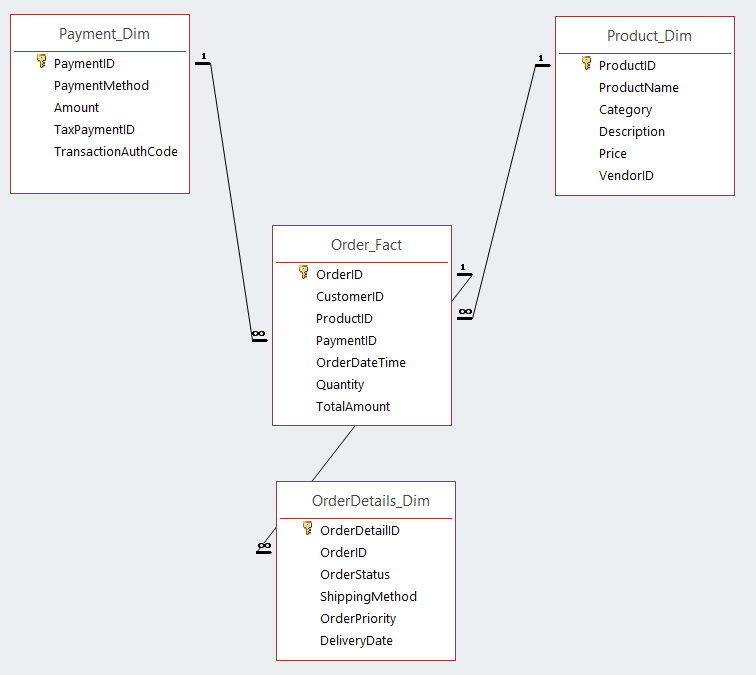
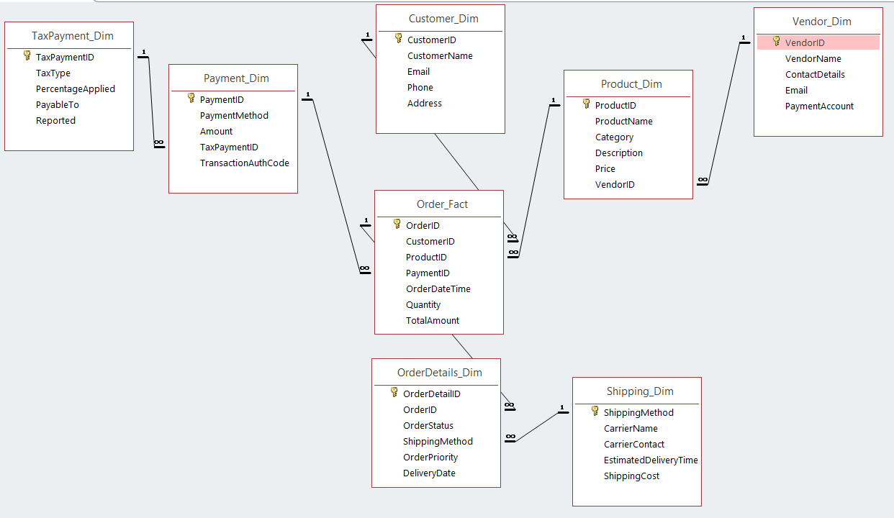

# Database-Design - Understanding-Star-and-Snowflake-Schemas

**Project Overview**

This project explores two fundamental database design concepts: the Star Schema and the Snowflake Schema. These schemas are vital in organizing data for efficient querying, storage, and analysis in both transactional and analytical systems. By diving into these structures, I aim to demonstrate their significance in data science and how they apply to real-world data scenarios.

**Key Concepts Explored**

**Star Schema**

The Star Schema is a simple and efficient database design used primarily in OLTP systems (Online Transaction Processing). It consists of a central fact table that is connected to dimension tables, which hold descriptive information. The design is optimized for fast query performance and simplicity, making it an ideal choice for transactional systems.

- Fact Tables: Store quantitative data such as sales figures or order amounts.
  
- Dimension Tables: Contain descriptive information, like customer details, product categories, or time periods.

- Benefits: The structure of the Star Schema allows for quick and simple querying, which is ideal for reporting and OLTP systems where high transaction volume is expected.

Above is the Star Schema design, where the fact table is at the center, surrounded by dimension tables. This design is ideal for simplifying queries in transactional environments.

**Snowflake Schema**

The Snowflake Schema is a more normalized version of the Star Schema. It breaks down the dimension tables into additional sub-dimensions, which reduces data redundancy and increases consistency. This design is commonly used in OLAP systems (Online Analytical Processing), where large datasets are processed and analyzed.

- Fact Tables: Like in the Star Schema, these store the core business data such as sales or transactions.
Normalized

- Dimension Tables: Dimension tables are broken into multiple related sub-tables, ensuring that there’s less repetition of data.

- Benefits: The Snowflake Schema supports complex queries in analytical systems and helps maintain data consistency while reducing storage redundancy.

The Snowflake Schema adds layers of normalization to dimension tables, reducing redundancy and ensuring data consistency. This schema is commonly used in OLAP environments for data warehousing and analytical processing.

# Where These Schemas Are Applied

**OLAP**:  The Snowflake Schema is widely used in OLAP systems, which are designed to handle complex analytical queries on large datasets. Common applications include business intelligence platforms, data warehousing, and decision support systems.
Example: A business intelligence system that aggregates data from multiple sources to generate insights and reports for executives.

**OLTP**:  The Star Schema is often used in OLTP systems, where the goal is to handle frequent, real-time transactions. These systems are optimized for speed and are commonly found in retail, banking, and order processing systems.
Example: A retail point-of-sale (POS) system that processes customer transactions and inventory updates in real time.

# Conclusion

This project highlighted the importance of solid database design principles in data science. By understanding the strengths and applications of both the Star and Snowflake schemas, I learned how to tailor data architectures to meet the needs of different systems. Whether designing for speed in OLTP systems or for complex data analysis in OLAP systems, these schemas form the backbone of many data-driven applications.
